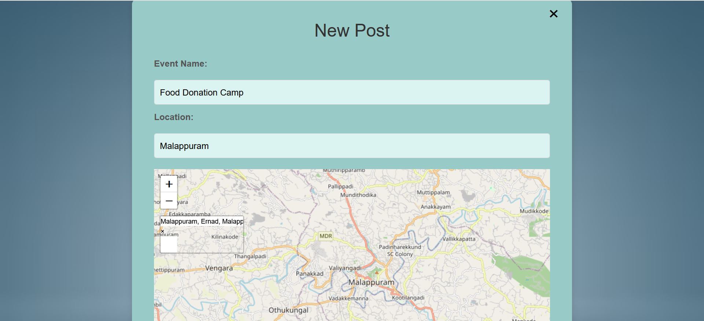

# ServeLink

"ServeLink-Empowering Communities through Volunteering" is a digital platform that connects volunteers with organizations, fostering a collaborative environment for positive social impact. It uses user-friendly interfaces, robust database management, and advanced algorithms to match volunteers with suitable projects. Emphasizing security and privacy, it aims to bridge the gap between volunteers and organizations, facilitating a powerful exchange of support and service.

<h1>Website images : </h1>
<h2>Home pages</h2>

<h2>About us</h2>

<h2>Volunteer Register/Login</h2>

<h3>Volunteer Dashboard</h3>

<h2>Organization</h2>

<h3>Organization post</h3>

<h3>Organization Dashboard </h3>

<h2>Events</h2>

